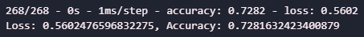
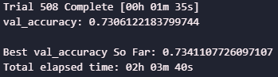
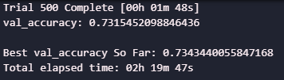
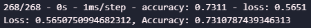

# Machine Learning Report

Note: *For the sake of simplicity and structure, the file names in this repo do not line up exactly with what was requested for this module challenge. The file named `model.h5` represents `AlphabetSoupCharity.h5`, and the file named `model_v2.h5` represents `AlphabetSoupCharity_Optimization`.*

## Pre-Processing

- The data was imported and cleaned
- Non-vital coluns dropped
- Uncommon Variables grouped together
- The data was then converted into binary variables for the model, and then saved as [processed_dat.csv](models&outputs/processed_dat.csv).
- This ensures that between the tuning and the model building, the same data could be utilized easily and in its processed form.
- The data was split into test and train data
- The X data was scaled using `scikit-learn`'s `StandardScalar()`.

## [`model.h5`](models&outputs/model.h5)

The first iteration of the model was made without any tuning, simply a best guess at parameters that might benefit the model. 

- This model had `3` layers with:
    - `80`
    - `50`
    - `1` nodes respectively
- Layers one and two utilized `relu` activation
- The output node utilized `sigmoid` activation
- The accuracy and loss statistics (as seen in the image above) are not spectacular, but not horrible either

The trained version of this model can be found in [here](models&outputs).

## Tuning

***The first cycle of tuning failed. Through the rest of this readme and all files within the repo, the tuners are referred to as tuner two and tuner three, tuner one never completed and was deleted in favor of the newer tuners.***

Tuner two showed minor progress. All of the tuning allowed `keras-tuner` to fine tune the activation, number of layers and units in each layer through hyperparameters. This allowed the tuner to sort through hundreds of potential models and report back which on performed best.

After two hours of tuning, the model was able to improve in accuracy by around `0.6%`, and improve (decrease) in loss by about `0.91%`. While not an enormous leap, it was progress nonetheless.

Tuner three had an even smaller improvement, indicating that the model was likely not going to do much better than it was currently using. 

With modest improvements of `<1%` for both accuracy and loss, there is likely not much more to squeeze out of this model in this form. 

## [`model_v2.h5`](models&outputs/model_v2.h5)

With the tuning completed, and hyperparamters that would (theoretically) push a model to be around `0.7%` better (more accurate) than the initial model, it was time to test.

This model was `0.29%` more accurate than the first, but had `0.49%` more loss. This contrasts with what the tuner found, which was a model that could perform as much as `1%` better in loss than the original model. However, the tuner is merely a tool to find which parameters give you *the best chance* and hitting your accuracy goals. 

The trained version of this model can be found in [here](models&outputs).

## Conclusions

`model.h5` is a solid model. `model_v2.h5` is not any better. There is a weird tradeoff in this scenario, where `model_v2.h5` is more accurate than `model.h5`, but is wrong by more when it's wrong. It could also be the case that in order to focus on accuracy, the tuner made concessions with loss to squeeze the most out of it that it could. 

The final call is that these two models will perform within `1%` of each other almost every time. The tradeoffs are within a single percentage point for both key metrics, so there isn't a ton of leverage that one model has over the other. Ideally, a model to predict financial information like this would be more accurate than `73%`, and another model might be able to acheive this. In the perfect storm, this model might do better as well. However, the possibility exists that in the type of data that this model has been trained for, not enough concrete patterns exist to predict with much more accuracy than these models were capable of. 

Given that this is a non-profit, and funding is not in hopes of great return but rather succesfully investing in the community, `73%` should be more than accurate enough to justify using this for future predictions. 
